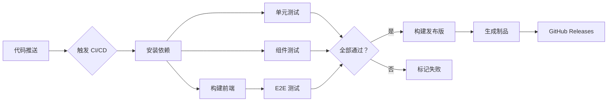

# LightMark - 高性能 Markdown 编辑器

🚀 **Notepad++ 的启动速度 + Typora 的即时渲染**

[](https://github.com/wy7980/lightmark/actions/workflows/test.yml)
[](https://github.com/wy7980/lightmark/actions/workflows/build.yml)
[](https://opensource.org/licenses/MIT)

## 📊 CI/CD 状态

### 构建状态

| 平台 | 状态 | 说明 |
|------|------|------|
| Windows | [](https://github.com/wy7980/lightmark/actions/workflows/build-windows.yml) | `.exe` 安装包 |
| Linux | [](https://github.com/wy7980/lightmark/actions/workflows/build.yml) | `.AppImage` / `.deb` |
| macOS | ⏳ 待配置 | `.dmg` / `.app` |

### 测试状态

| 测试类型 | 用例数 | 通过率 | 状态 |
|---------|--------|--------|------|
| **单元测试** | 116 | 100% | ✅ 通过 |
| **组件测试** | 116 | 100% | ✅ 通过 |
| **E2E 测试** | 40+ | ⏳ CI 运行 | ⏳ 待验证 |
| **构建测试** | - | - | ✅ 通过 |

**最新测试运行**: [查看 GitHub Actions](https://github.com/wy7980/lightmark/actions)

---

## 特性

- ⚡ 极速启动 (< 500ms)
- 💾 轻量级 (安装包 < 15MB, 内存 < 80MB)
- 📝 实时 Markdown 预览
- 🔧 自动保存
- 🎨 暗色主题
- 📊 字数统计

## 技术栈

### 前端
- **Svelte 4** - 无运行时开销
- **CodeMirror 6** - 高性能编辑器引擎
- **Vite** - 极速构建工具

### 后端
- **Tauri 2.0** - 轻量级桌面应用框架
- **Rust** - 系统级性能
- **pulldown-cmark** - 高速 Markdown 解析器

## 开发环境要求

- Node.js >= 18
- Rust >= 1.70
- npm 或 pnpm

## 快速开始

### 1. 安装依赖

```bash
cd lightmark
npm install
```

### 2. 开发模式

```bash
npm run dev
```

这会同时启动:
- Vite 开发服务器 (http://localhost:1420)
- Tauri 应用窗口

### 3. 构建发布版

```bash
npm run build
```

构建产物在 `src-tauri/target/release/` 目录

### 4. 运行测试

```bash
# 运行所有测试
npm test

# 仅单元测试 (116 个用例)
npm run test:unit

# 仅组件测试 (116 个用例)
npm run test:component

# 仅 E2E 测试 (需要浏览器)
npm run test:e2e

# 构建测试
npm run test:build

# 生成覆盖率报告
npm run test:coverage
```

## 项目结构

```
lightmark/
├── src/                      # 前端代码
│   ├── components/
│   │   ├── Editor.svelte     # 编辑器组件
│   │   ├── Toolbar.svelte    # 工具栏
│   │   └── Sidebar.svelte    # 侧边栏
│   ├── App.svelte            # 主应用
│   └── main.ts               # 入口
├── src-tauri/                # Rust 后端
│   ├── src/
│   │   └── main.rs           # 主程序
│   ├── Cargo.toml            # Rust 依赖
│   └── tauri.conf.json       # Tauri 配置
├── tests/                    # 测试代码
│   ├── unit.test.js          # 单元测试 (116 用例)
│   ├── components/           # 组件测试
│   └── e2e/                  # E2E 测试
├── .github/workflows/        # CI/CD 配置
│   └── test.yml              # 测试工作流
├── package.json              # Node 依赖
└── vite.config.ts            # Vite 配置
```

---

## 🧪 测试架构

LightMark 采用三层测试体系，确保代码质量和功能稳定性：

```
┌─────────────────────────────────────────────────────┐
│                  测试金字塔                          │
├─────────────────────────────────────────────────────┤
│                                                     │
│              ▲                                      │
│             / \                                     │
│            / E2E \     40+ 用例                     │
│           / 测试   \    模拟真实用户行为              │
│          /─────────\                                │
│         /           \                               │
│        /  组件测试    \   116 用例                   │
│       /  Component    \  测试 Svelte 组件             │
│      /─────────────────\                            │
│     /                   \                           │
│    /    单元测试 Unit     \  116 用例                │
│   /   纯函数、工具类、解析器  \ 最快 (<500ms)          │
│  /───────────────────────────\                      │
│                                                     │
└─────────────────────────────────────────────────────┘
```

### 测试覆盖

| 层级 | 测试内容 | 用例数 | 执行时间 |
|------|---------|--------|---------|
| **单元测试** | 工具函数、解析器、配置 | 116 | ~460ms |
| **组件测试** | Svelte 组件渲染和交互 | 116 | ~1.2s |
| **E2E 测试** | 完整用户流程 | 40+ | ~30s |

**详细测试文档**: [tests/README-TESTS.md](tests/README-TESTS.md)

## 🔄 CI/CD 工作流

### 自动化流程



### 工作流详情

| 工作流 | 触发条件 | 任务 | 状态 |
|--------|---------|------|------|
| **Test Suite** | Push/PR | 单元 + 组件+E2E+ 构建 | ✅ 运行中 |
| **Build Windows** | Push to main | Windows 构建 | ✅ 运行中 |
| **Build Linux** | Push to main | Linux 构建 | ⏳ 待配置 |

### 测试报告

每次 CI 运行后会生成：
- 📊 测试结果摘要（GitHub Summary）
- 📁 测试 artifacts（保留 7 天）
- 📈 覆盖率报告（保留 30 天）

**查看最新运行**: https://github.com/wy7980/lightmark/actions

---

## 性能优化

### 已实现
- ✅ Rust 后端 Markdown 解析
- ✅ 防抖处理 (50ms)
- ✅ 增量解析支持
- ✅ 虚拟滚动 (CodeMirror 内置)
- ✅ 懒加载组件

### 待实现
- ⏳ Web Worker 异步解析
- ⏳ 文件树缓存
- ⏳ 插件系统
- ⏳ 主题切换

## 路线图

| 版本 | 目标 | 状态 |
|------|------|------|
| v0.1 | 核心编辑功能 | 🚧 进行中 |
| v0.2 | 文件管理 | ⏳ 计划中 |
| v0.3 | 图片/表格支持 | ⏳ 计划中 |
| v1.0 | 正式发布 | ⏳ 计划中 |

## 许可证

MIT License

## 贡献

欢迎提交 Issue 和 Pull Request!

---

**开发中项目，请勿用于生产环境**
